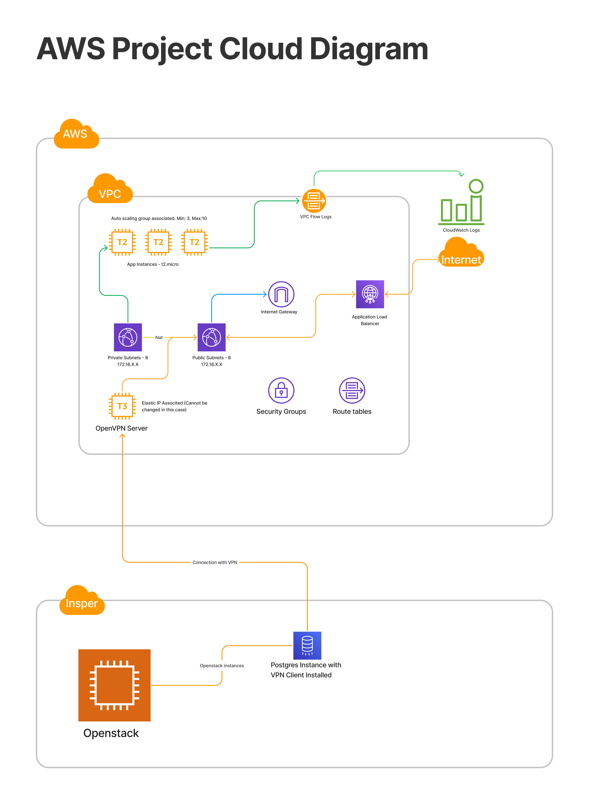
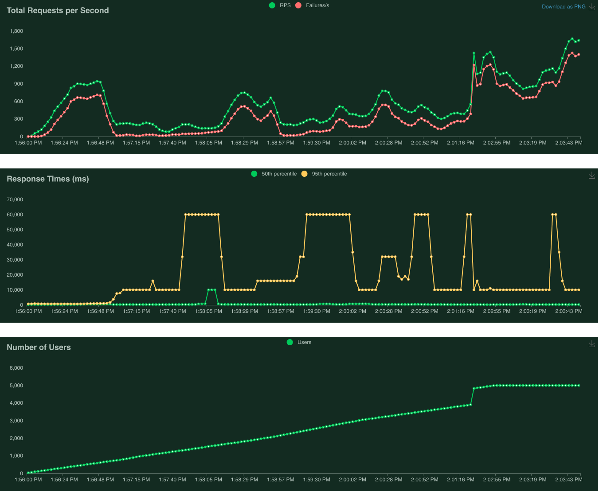

# Relatório do Projeto Final

## Sumário
- [Relatório do Projeto Final](#relatório-do-projeto-final)
  - [Sumário](#sumário)
  - [Disclaimer](#disclaimer)
  - [Topologia](#topologia)
  - [Estimativa de custos](#estimativa-de-custos)
  - [Setup de Rede](#setup-de-rede)
  - [Instruções](#instruções)
  - [Locust com IaaC](#locust-com-iaac)
  - [VPN - Conceito A](#vpn---conceito-a)
  - [Autor](#autor)

---

## Disclaimer
Este projeto foi configurado para execução sem necessidade de ajustes adicionais no kit W do OpenStack no Insper. As configurações já estão pré-estabelecidas e qualquer intervenção manual é desaconselhada devido a potenciais instabilidades no OpenStack. É importante usar a conta `andrebrito16` na AWS, já que IPs elásticos específicos foram alocados a ela.

## Topologia
O projeto tem como objetivo desenvolver uma aplicação com acesso a banco de dados usando recursos da AWS, incluindo EC2, VPC, Security Groups, entre outros. A topologia é ilustrada abaixo, com uma conexão via VPN para a instância do OpenStack no Insper.



---

## Estimativa de custos

A estimativa de custos foi realizada pela calculadora da AWS e pode ser conferida no arquivo 


## Setup de Rede
O setup inicial da rede envolve a criação de uma VPC e a atribuição de subnets públicas e privadas. Foram configuradas 8 subnets (4 públicas e 4 privadas), além de um internet gateway, NATs para redes internas, e outros recursos como DHCP para testes.


## Instruções
1. Clone o repositório.
2. Use a conta `andrebrito16` na AWS devido ao IP elástico pré-alocado para a VPN.
3. Crie um bucket do S3 para o estado do Terraform. O nome padrão é `ab-terraform-bucket-state` ou defina outro no arquivo `main.tf`.
4. Execute os comandos:
    ```bash
    terraform init
    terraform plan
    terraform apply --auto-approve
    ```
5. Após o provisionamento, o endereço DNS do Application Load Balancer será exibido como output. Aguarde até 5 minutos para que a aplicação fique disponível.
6. O endereço para acessar a aplicação via ALB e as rotas disponíveis serão informados no output.


## Locust com IaaC
Foi criada uma infraestrutura na AWS para testes de carga com Locust, utilizando Terraform. Os testes envolvem um master e 4 workers, com 5000 usuários e um rate de 12/segundo. As falhas observadas se devem a instabilidades na rede e na conexão com o banco de dados. O terraform da infraestrutura do Locust está disponível [nesse link](https://github.com/andrebrito16/aws-ec2-locust)



## VPN - Conceito A
Para a VPN no kit OpenStack, utilizamos uma VPN assimétrica (OpenVPN). O servidor de VPN é provisionado via Terraform e se conecta automaticamente ao cliente no Insper assim que a infraestrutura é levantada.

## Autor

Com ❤️ por [André Brito](https://andreb.dev).

Orientado pelos professores Rodolfo Avelino e Thiago Demai.